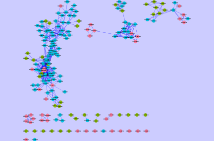
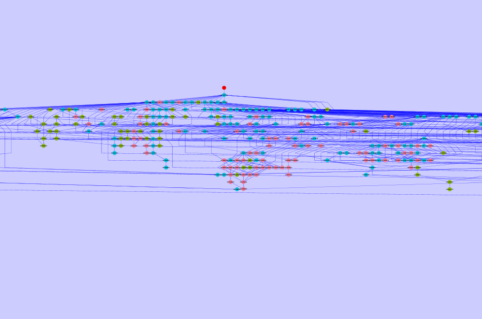
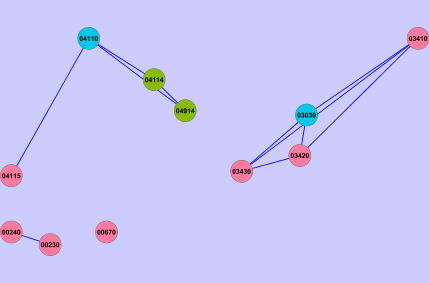

<!--
% \VignetteEngine{knitr}
% \VignetteIndexEntry{categoryCompare: High-throughput data meta-analysis using gene annotations}
% \VignetteDepends{categoryCompare, GO.db, KEGG.db, affy, hgu95av2.db, genefilter, estrogen, limma}
% \VignetteKeyword{categoryCompare, meta-analysis, gene ontology, kegg}
% \VignettePackage{categoryCompare}
-->

# categoryCompare: High-throughput data meta-analysis using feature annotations

Authored by: **Robert M Flight** `<rflight79@gmail.com>` on `r Sys.time()`

## Introduction

Current high-throughput molecular biology experiments are generating larger and larger amounts of data. Although there are many different methods to analyze individual experiments, methods that allow the comparison of different data sets are sorely lacking. This is important due to the number of experiments that have been carried out on biological systems that may be amenable to either fusion or comparison. Most of the current tools available focus on finding those genes in experiments that are listed as the same, or that can be shown statistically that it is significant that the gene was listed in the results of both experiments. 

However, what many of these tools do not do is consider the similarities (and just as importantly, the differences) between experimental results at the categorical level. Categoical data includes any gene annotation, such as Gene Ontologies, KEGG pathways, chromosome location, etc. categoryCompare has been developed to allow the comparison of high-throughput experiments at a categorical level, and to explore those results in an intuitive fashion.

## Sample Data

To make the concept more concrete, we will examine data from the microarray data set `estrogen` available from Bioconductor. This data set contains 8 samples, with 2 levels of estrogen therapy (present vs absent), and two time points (10 and 48 hours). A pre-processed version of the data is available with this package, the commands used to generate it are below. Note: the preprocessed one keeps only the top 100 genes, if you use it the results will be slightly different than those shown in the vignette.

```{r loadLibs, message=FALSE}
library("affy")
library("hgu95av2.db")
library("genefilter")
library("estrogen")
library("limma")
```

```{r loadMeta}
datadir <- system.file("extdata", package = "estrogen")
pd <- read.AnnotatedDataFrame(file.path(datadir,"estrogen.txt"), 
  	header = TRUE, sep = "", row.names = 1)
pData(pd)
```

Here you can see the descriptions for each of the arrays. First, we will read in the cel files, and then normalize the data using RMA.

```{r loadAffy}
currDir <- getwd()
setwd(datadir)
a <- ReadAffy(filenames=rownames(pData(pd)), phenoData = pd, verbose = TRUE)
setwd(currDir)
```

```{r normalizeAffy, message=FALSE}
eData <- rma(a)
```

To make it easier to conceptualize, we will split the data up into two eSet objects by time, and perform all of the manipulations for calculating significantly differentially expressed genes on each eSet object.

So for the 10 hour samples:

```{r edata10}
e10 <- eData[, eData$time.h == 10]
e10 <- nsFilter(e10, remove.dupEntrez=TRUE, var.filter=FALSE, 
        feature.exclude="^AFFX")$eset

e10$estrogen <- factor(e10$estrogen)
d10 <- model.matrix(~0 + e10$estrogen)
colnames(d10) <- unique(e10$estrogen)
fit10 <- lmFit(e10, d10)
c10 <- makeContrasts(present - absent, levels=d10)
fit10_2 <- contrasts.fit(fit10, c10)
eB10 <- eBayes(fit10_2)
table10 <- topTable(eB10, number=nrow(e10), p.value=1, adjust.method="BH")
table10$Entrez <- unlist(mget(rownames(table10), hgu95av2ENTREZID, ifnotfound=NA))
```

And the 48 hour samples we do the same thing:

```{r edata48}
e48 <- eData[, eData$time.h == 48]
e48 <- nsFilter(e48, remove.dupEntrez=TRUE, var.filter=FALSE, 
        feature.exclude="^AFFX" )$eset

e48$estrogen <- factor(e48$estrogen)
d48 <- model.matrix(~0 + e48$estrogen)
colnames(d48) <- unique(e48$estrogen)
fit48 <- lmFit(e48, d48)
c48 <- makeContrasts(present - absent, levels=d48)
fit48_2 <- contrasts.fit(fit48, c48)
eB48 <- eBayes(fit48_2)
table48 <- topTable(eB48, number=nrow(e48), p.value=1, adjust.method="BH")
table48$Entrez <- unlist(mget(rownames(table48), hgu95av2ENTREZID, ifnotfound=NA))
```

And grab all the genes on the array to have a background set.

```{r gUniverse}
gUniverse <- unique(union(table10$Entrez, table48$Entrez))
```

For both time points we have generated a list of genes that are differentially expressed in the present vs absent samples. To compare the time-points, we could find the common and discordant genes from both experiments, and then try to interpret those lists. This is commonly done in many meta-analysis studies that attempt to combine the results of many different experiments. 

An alternative approach, used in `categoryCompare`, would be to compare the significantly enriched categories from the two gene lists. Currently the package supports two category classes, Gene Ontology, and KEGG pathways. Both are used below.

Note 1: I am not proposing that this is the best way to analyse *this* particular data, it is a sample data set that merely serves to illustrate the functionality of this package. However, there are many different experiments where this type of approach is definitely appropriate, and it is up to the user to determine if their data fits the analytical paradigm advocated here.

## Create Gene List

```{r createGeneList, message=FALSE}
library("categoryCompare")
library("GO.db")
library("KEGG.db")

g10 <- unique(table10$Entrez[table10$adj.P.Val < 0.05])
g48 <- unique(table48$Entrez[table48$adj.P.Val < 0.05])
```

For each list the genes of interest, and a background must be defined. Here we are using those genes with an adjusted P-value of less than 0.05 as the genes of interest, and all of the genes on the chip as the background.

```{r viewLists}
list10 <- list(genes=g10, universe=gUniverse, annotation='org.Hs.eg.db')
list48 <- list(genes=g48, universe=gUniverse, annotation='org.Hs.eg.db')

geneLists <- list(T10=list10, T48=list48)
geneLists <- new("ccGeneList", geneLists, ccType=c("BP","KEGG"))
fdr(geneLists) <- 0 # this speeds up the calculations for demonstration
geneLists
```

## Annotation Enrichment

Now run the enrichment calculations on each list. In this case enrichment will be performed using the biological process (BP) Gene Ontology, and KEGG Pathways.

```{r runEnrichment}
enrichLists <- ccEnrich(geneLists)
enrichLists
```

There are a lot of GO BP processes enriched using the p-value cutoff of 0.05, so lets make that more stringent (`0.001`). This is done here merely for speed, in a usual analysis you should choose this number, and the type of cutoff (p-value or fdr) carefully.

```{r modPVal}
pvalueCutoff(enrichLists$BP) <- 0.001
enrichLists
```

Currently you can see that for T10, there are 141 processes enriched, and 123 for T48. For KEGG, there are much smaller numbers of pathways enriched.

To see which processes and pathways are enriched, and to compare them, we will run `ccCompare`, after generating a `ccOptions` object to tell the software exactly which comparisons to do.

```{r ccOptions}
ccOpts <- new("ccOptions", listNames=names(geneLists), outType='none')
ccOpts
```

```{r ccResults}
ccResults <- ccCompare(enrichLists,ccOpts)
ccResults
```

The `ccResults` is a list object where for each type of category (Gene Ontologies, KEGG pathways, etc) there are `ccCompareResult` objects containing various pieces, including the output of the enrichments in table form (`mainTable`) with a designation as to which of the geneLists they originated from, a graph that shows how the annotations are connected to each other (`mainGraph`), and which genes belong to which annotation, and which list they originated from (`allAnnotation`).

## Visualization

Currently the easiest way to visualize and interact with this data is by using Cytoscape and the `RCytoscape` package. To set up `RCytoscape`, see the [`RCytoscape` webiste](http://rcytoscape.systemsbiology.net/versions/current/index.html) .

```{r setupRunningCytoscape, echo=FALSE, error=FALSE, results='asis'}
runCy <- FALSE

try({
  tmp <- RCytoscape::CytoscapeWindow("tmp")
  runCy <- TRUE
  RCytoscape::deleteWindow(tmp)
})

if (!runCy){
  print("No connection to Cytoscape available, subsequent visualizations were not run")
}
```

Once you have [Cytoscape](http://cytoscape.org) up and running with the `CytoscapeRPC` plugin running, then we can examine the results from each category of annotations. First up, GO Biological Process.

```{r cwBP, eval=runCy}
cw.BP <- ccOutCyt(ccResults$BP,ccOpts)
```


You should now see something in Cytoscape that somewhat resembles the above figure. Reddish nodes came from T10, green from T48, and the blue ones from both. The edges determine that some of the genes are shared between annotations (nodes), and are weighted by how many genes are shared. The graph is layed out using a *force-directed* layout, and the force on the edges is determined by the number of shared genes. Right now there are a few groupings of nodes, that are probably functionally related. However, there is also a large mass of interconnected nodes in the middle, due to the shared genes in the annotation. We may get a better picture of this if we **break** the edges between nodes that share lower numbers of genes. The weight of the connections is based on the work of Bader and co-workers.

```{r breakHighBP, eval=runCy}
breakEdges(cw.BP,0.2)
breakEdges(cw.BP,0.4)
breakEdges(cw.BP,0.6)
breakEdges(cw.BP,0.8)
```

```{r deleteBP, include=FALSE, eval=runCy}
RCytoscape::deleteWindow(cw.BP)
```



By the time you get to breaking any edges with a weight less than 0.8, you should see some very distinct groups of nodes (see the above figure). Because the numbers of genes shared between these nodes is high, it is likely that these groups of nodes describe a functional "theme" that will hopefully tell you something about the genes involved in the biological process that you are examining. This view also shows that even if there are no nodes that explicitly show up in both lists, if there are a series of annotations from each list in a well connected group, then perhaps there is still some similarity between the lists in this area.

To see a description of the nodes and their listMembership, as well as other information about each node, you can use the **Data Panel** in Cytoscape, and select the node attributes that you want listed when you select a node. To discover the **theme** of a group of nodes, select all the nodes that belong to a group.

To view the GO nodes in the GO directed-acyclic graph (DAG) hierarchy, we need to change the graph type and re-run `ccCompare` function. The output is shown in the next figure.

```{r GOHierarchical}
graphType(enrichLists$BP) <- "hierarchical"
ccResultsBPHier <- ccCompare(enrichLists$BP, ccOpts)
ccResultsBPHier
```

```{r hier2Cytoscape, eval=runCy}
cw.BP2 <- ccOutCyt(ccResultsBPHier, ccOpts, "BPHier")
```

```{r deleteHier, include=FALSE, eval=runCy}
RCytoscape::deleteWindow(cw.BP2)
```



Note that the current hierarchical layout in Cytoscape does not seem to generate layouts that are easy to follow. This layout should only be used when there are small numbers of GO annotations.

We can do a similar process for the KEGG pathways as well.

```{r cytoscapeKEGG, eval=runCy}
cw.KEGG <- ccOutCyt(ccResults$KEGG,ccOpts)
```

```{r deleteKEGG, include=FALSE, eval=runCy}
RCytoscape::deleteWindow(cw.KEGG)
```



If you don't feel that there are enough nodes to work with the data, you may want to change the P-value cutoff used using `pvalueCutoff`, or even the type of P-value, using `pvalueType`.

## Acknowledgements

This package depends heavily on classes and functionality from `Category`, `graph`, and the interactive network visualization capabilities enabled by `RCytoscape`. 

```{r sessionInfo}
sessionInfo()
```

